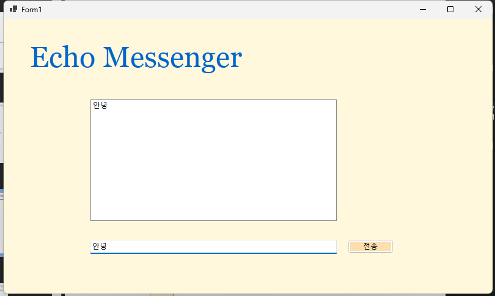
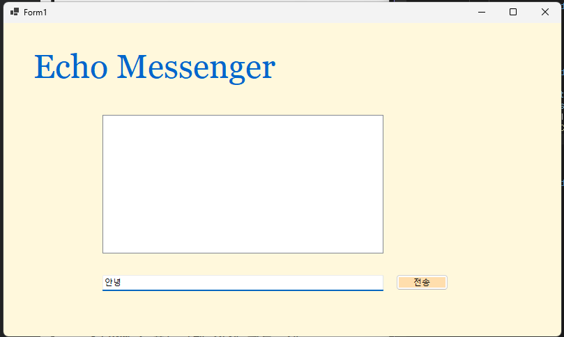
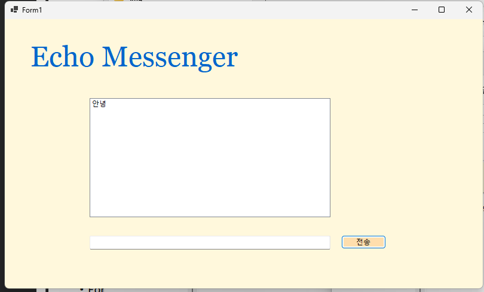
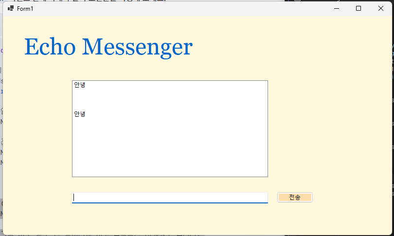
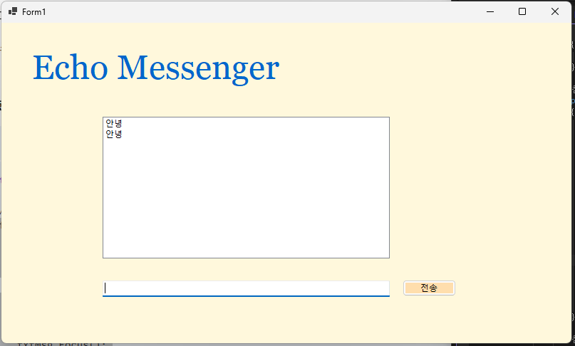
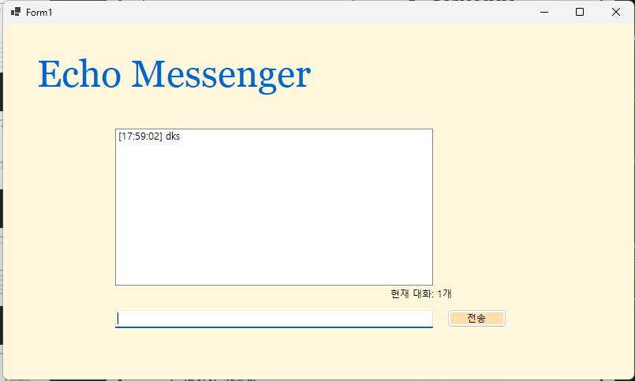
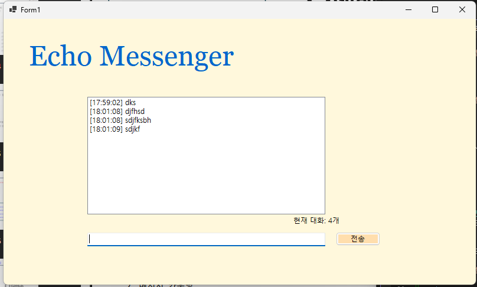
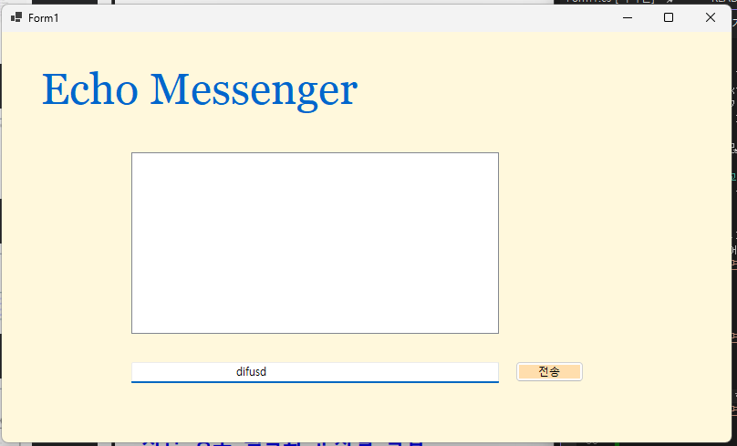
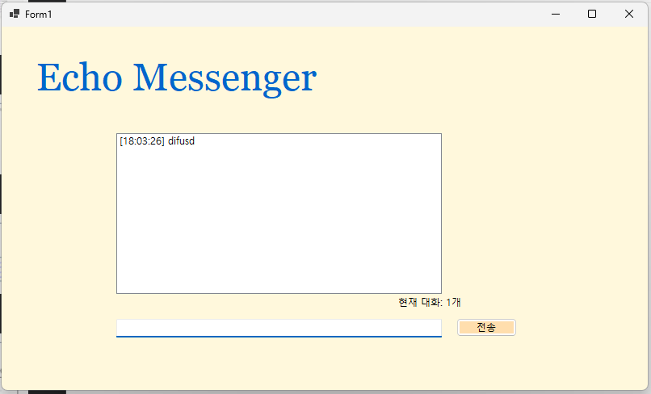

# (C# 코딩) Echo Messenger
## 개요
- C# 프로그래밍 학습
- 1줄 소개: 사용자 키보드 입력을 받아서 처리하는 프로그램
- 사용한 플랫폼: C#, .NET Windows Forms, Visual Studio, GitHub
- 사용한 컨트롤: Label, TextBox, ListBox, Button
- 사용한 기술과 구현한 기능:
- Visual Studio를 이용하여 UI 디자인
- string 클래스를 이용한 사용자 입력 데이터 처리
- DateTime 클래스를 이용한 현재시간 정보 구하기
- myListBox.Items 리스트 박스에 들어 있는 모든 아이템 추가, 제거, 모두 제거하기
- ListBox를 이용해 내부의 항목들을 Items라는 주머니에 저장

## 실행 화면 (과제1)
- 과제1 코드의 실행 스크린샷
 
 
- UI

 
 
 
-전송 기능 구현 완료
 : 전송 버튼 클릭 시 TextBox의 텍스트를 ListBox의 항목(Items)으로 추가함

  
  
  
 -전송 버튼 누르기 전
 : TextBox에 텍스트가 남아있음

  
  
  
 -전송 버튼 누른 후
 : Textbox에 텍스트를 비워(Clear) 다음 입력을 준비함 

### 과제 내용

1. UI 구성
▶ Label(표시), TextBox(입력), Button(전송), ListBox(대화창)를 적절히 배치합니다.
2. 전송 기능
▶ 전송 버튼 클릭 시 TextBox의 텍스트를 ListBox의 항목(Items)으로 추가합니다.
3. 입력창 정리
▶ 추가 직후 TextBox의 내용을 비워(Clear) 다음 입력을 준비합니다.

## 실행 화면 (과제2)
- 과제2 코드의 실행 스크린샷
 
 
-(수정 전) 내용이 없는 빈 문자열이나 공백(Space)만 있을 때는 메시지가 전송됨

 
 
 

-(수정 후)  내용이 없는 빈 문자열이나 공백(Space)만 있을 때는 메시지가 전송되지 않도록 방지함

### 과제 내용
1. 입력창의 기존 메시지 지우기
▶ 전송이 끝나면 입력창에 남겨진 기존 메시지를 삭제합니다.
2. 입력창에 입력 포커스 갖다 놓기
▶ 전송 후에 마우스로 입력창을 다시 클릭하지 않아도 되도록 커서를 자동으로 입력창에둡니다.
3. 엔터키로 전송하기
▶ 마우스 클릭 대신 키보드의 Enter 키를 눌러도 메시지가 전송되도록 합니다.
4. 입력 방어
▶ 내용이 없는 빈 문자열이나 공백(Space)만 있을 때는 메시지가 전송되지 않도록 방지합니다.

## 실행 화면 (과제3)
- 과제3 코드의 실행 스크린샷
 
 
- 타임스탬프 추가
   : 메시지 앞에 현재 시간을 자동으로 결합하여 리스트에 출력함

 
 
 
- 현재 리스트에 쌓인 총 메시지 개수를 계산하여 하단 Label에 실시간으로 업데이트함

 
 
 
- 사용자가 입력한 메시지의 앞뒤 불필요한 공백을 Trim() 함수로 제거하여 저장함

### 과제 내용
1. 타임스탬프 추가
▶ 메시지 앞에 현재 시간([14:20:05])을 자동으로 결합하여 리스트에 출력합니다.
2. 메시지 카운팅
▶ 현재 리스트에 쌓인 총 메시지 개수를 계산하여 하단 Label에 실시간으로 업데이트합니다.
▶ 예: "현재 대화: 12개“
4. 문자열 정제
▶ 사용자가 입력한 메시지의 앞뒤 불필요한 공백을 Trim() 함수로 제거하여 저장합니다.

  ## 실행 화면 (과제4)
- 과제4 코드의 실행 스크린샷
 
 
-선택 항목 삭제

-전체 초기화

-글자 수 제한

### 과제 내용
1. 선택 항목 삭제
▶ ListBox에서 특정 메시지를 마우스로 클릭하고 '삭제' 버튼을 누르면 해당 항목만 목록에서제거합니다. (단, 선택하지 않고 삭제 시 발생하는 에러를 예외 처리해야 함)
2. 전체 초기화
▶ '대화 기록 삭제' 버튼을 클릭하면 리스트의 모든 내용을 한 번에 지웁니다.
3. 글자 수 제한
▶ 입력창에 글자 수를 50자로 제한하고, 초과시 사용자에게 경고 메시지를 띄우거나 전송을차단합니다.
