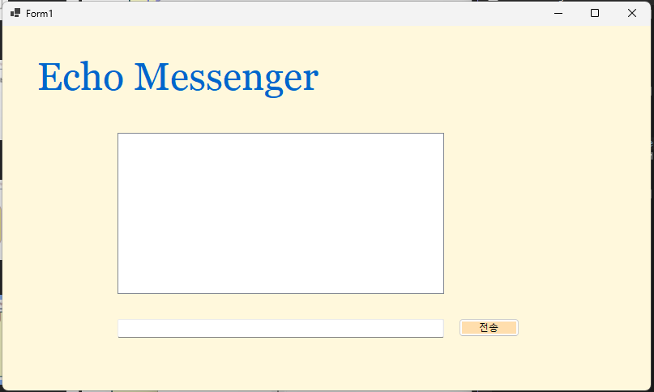

# (C# 코딩) Echo Messenger
## 개요
- C# 프로그래밍 학습
- 1줄 소개: 사용자 키보드 입력을 받아서 처리하는 프로그램
- 사용한 플랫폼:
- C#, .NET Windows Forms, Visual Studio, GitHub
- 사용한 컨트롤:
- Label, TextBox, ListBox, Button
- 사용한 기술과 구현한 기능:
- Visual Studio를 이용하여 UI 디자인
- string 클래스를 이용한 사용자 입력 데이터 처리
- DateTime 클래스를 이용한 현재시간 정보 구하기
- 수업 중에 배우고 사용했던 클래스들 관련된 설명
-
-
- 실습 중에 구현한 기능들 설명
-
-

## 실행 화면 (과제1)
- 과제1 코드의 실행 스크린샷

- UI 완성 

(img/2.png)
-전송 기능 구현 완료
 : 전송 버튼 클릭 시 TextBox의 텍스트를 ListBox의 항목(Items)으로 추가함

(img/b.png)
-전송 버튼 누르기 전
 : TextBox에 텍스트가 남아있음

(img/c.png)
-전송 버튼 누른 후
 : Textbox에 텍스트를 비워(Clear) 다음 입력을 준비함

- Label(표시), TextBox(입력), Button(전송), ListBox(대화창)를 적절히 배치합니다.- 전송 버튼 클릭 시 TextBox의 텍스트를 ListBox의 항목(Items)으로 추가합니다.
- 추가 직후 TextBox의 내용을 비워(Clear) 다음 입력을 준비합니다.
- 구현 내용과 기능 설명
- 입력창에 메시지 입력하고 전송 버튼을 누르면 메시지가 리스트 박스에 표시된다.
- 계속 반복하면 메시지가 리스트 박스에 한 줄씩 계속 추가된다.
- 추가 내용이 많아지면 리스트 박스에 스크롤바가 자동으로 생기고 스크롤된다.